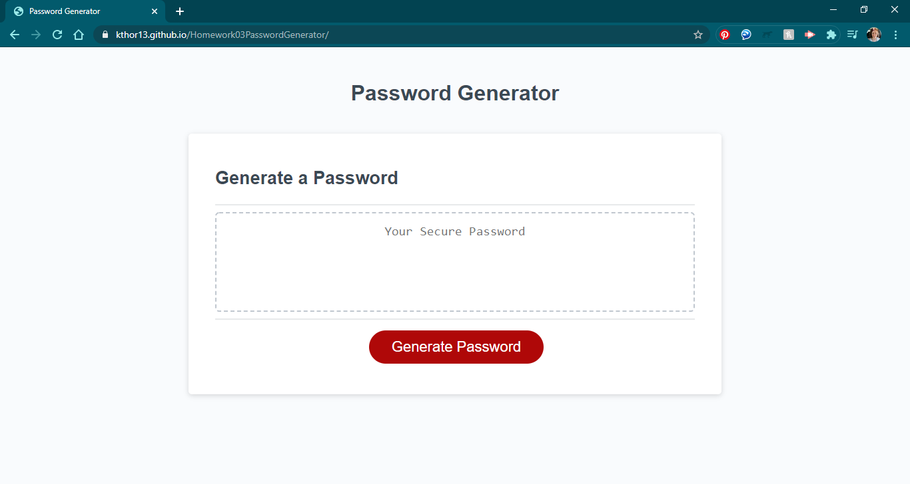
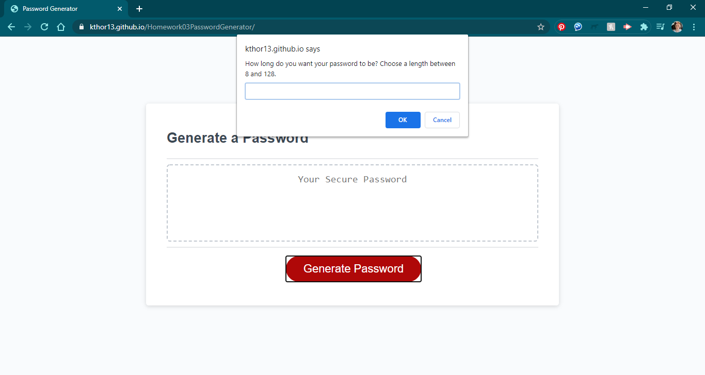
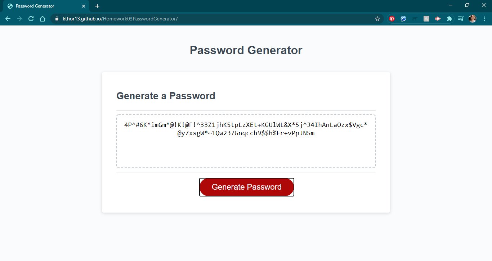

# 03 JavaScript: Password Generator

## My Task

I had to write JavaScript that would prompt the user to answer a series of questions about the requirements they would like to have in a password. The password had to be between 8 and 128 characters and the user could choose from lower case letters, upper case letters, numbers, and special characters. Then I had to use these criteria to build a password of the requested length with the requested characters.


## User Story

```
AS AN employee with access to sensitive data
I WANT to randomly generate a password that meets certain criteria
SO THAT I can create a strong password that provides greater security
```

## Acceptance Criteria

```
GIVEN I need a new, secure password
WHEN I click the button to generate a password
THEN I am presented with a series of prompts for password criteria
WHEN prompted for password criteria
THEN I select which criteria to include in the password
WHEN prompted for the length of the password
THEN I choose a length of at least 8 characters and no more than 128 characters
WHEN prompted for character types to include in the password
THEN I choose lowercase, uppercase, numeric, and/or special characters
WHEN I answer each prompt
THEN my input should be validated and at least one character type should be selected
WHEN all prompts are answered
THEN a password is generated that matches the selected criteria
WHEN the password is generated
THEN the password is either displayed in an alert or written to the page
```

## Screen Shots

The following images show my web application's appearance and functionality:






## Links

Below are links to my deployed application and GitHub Repository:

* [Deployed Application](https://kthor13.github.io/Homework03PasswordGenerator/)

* [GitHub Repository](https://github.com/kthor13/Homework03PasswordGenerator)
